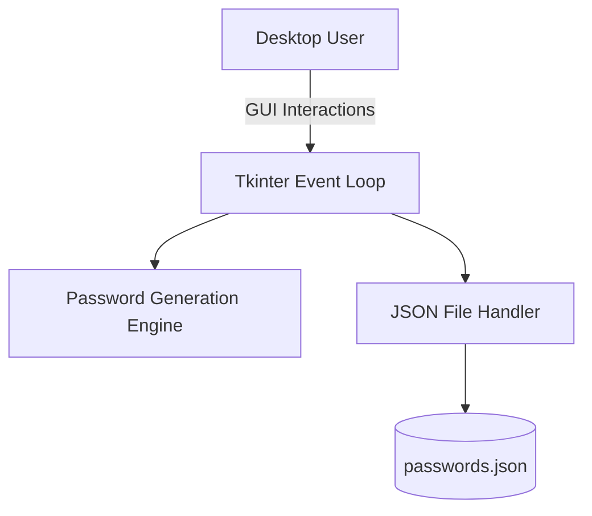

# Desktop Password Manager Vault

[](https://python.org)
[]()
[](LICENSE)

## Overview
This repository contains a standalone, offline desktop password manager application. Built natively with Python's Tkinter framework, it generates cryptographically strong passwords and manages state via localized JSON data persistence, eliminating the risk of cloud-based credential breaches.

## Problem Statement
Third-party cloud password managers (e.g., LastPass, 1Password) represent a centralized honeypot for threat actors. High-security environments often require "air-gapped" or purely offline credential vaults. This desktop application solves that by keeping the entire attack surface constrained to the local file system, ensuring credentials never traverse the public internet.

## Key Features
- **Deterministic Password Generation:** Utilizes randomized alphanumeric sequences with symbol injections to generate unbreakable baseline passwords.
- **Offline JSON Persistence:** Safely reads/writes vault data to a local `passwords.json` state file.
- **Native OS Execution:** Operates smoothly on macOS, Windows, and Linux via the Tkinter windowing toolkit without requiring Electron/Chromium overhead.
- **Search & Retrieve:** O(1) dictionary lookups to instantly query existing credentials by website or application name.

## Architecture



## Technology Stack
- **Application Engine:** Python 3.11
- **User Interface:** Tkinter
- **Data Layer:** `json` module
- **Testing:** `unittest`, `unittest.mock`

## Project Structure
```text
password-manager/
├── projects/
│   └── password_manager/
│       ├── main/
│       │   ├── Main.py         # Tkinter GUI event loop and core logic
│       │   └── passwords.json  # Localized credential vault
│       └── working.md          # Internal structural notes
├── tests/
│   └── test_persistence.py     # JSON read/write integrity mock tests
└── README.md                   # System documentation
```

## Installation
Ensure Python 3 is installed natively on your OS.
```bash
git clone https://github.com/krsna016/password-manager.git
cd password-manager/projects/password_manager/main
```

## Usage
Execute the GUI application directly via the Python interpreter:
```bash
python3 Main.py
```

## Examples
*Example JSON Vault structure maintained by the application:*
```json
{
  "GitHub": {
    "email": "developer@example.com",
    "password": "xY7!qP9#mB2$vL5"
  }
}
```

## Screenshots
> [!NOTE]
> *Tkinter UI application screenshots are pending capture.*

## Visual Demonstrations
> [!NOTE]
> *A GIF demonstrating the password generation speed is pending.*

## Testing
We utilize Python's built-in `unittest` framework to aggressively mock `builtins.open`, ensuring test runs do not overwrite or corrupt your actual `passwords.json` vault file.
```bash
python3 -m unittest discover tests/
```

## Performance Notes
- **Memory Footprint:** By utilizing Tkinter instead of Electron, the application consumes roughly ~25MB of RAM at runtime compared to Electron's 200MB+ baseline.

## Future Improvements
- **AES-256 Encryption:** Implement `cryptography` fernet symmetric encryption so the `passwords.json` file is strictly encrypted at rest.
- **Clipboard TTL:** Automatically wipe the system clipboard 30 seconds after copying a password to prevent background malware harvesting.

## Contributing
Please ensure all GUI logic modifications do not block the Tkinter `mainloop()`. Do not submit PRs containing plaintext passwords in test fixtures.

## License
Licensed under the MIT License.
